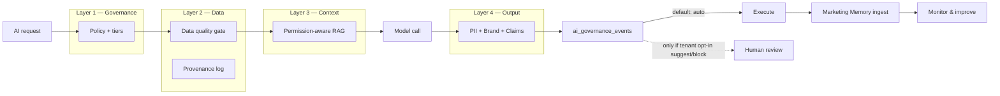

# InfoGenie — AI Governance Build Spec

**Version:** 1.1  
**Date:** 2026-08-03  
**Branch target:** `cursor/ai-governance-767a` (net-new, builds on `ecosystem-spine`)  
**Framework:** 4 Layers of AI Governance (Policy → Data → Retrieval → Output)

---

## 0. Non-restrictive defaults (HARD REQUIREMENTS)

Governance must answer **“Can we prove what AI did?”** — not **“Can AI do less?”**

These rules are **non-negotiable** for any implementation PR. If a change violates them, it is out of scope.

| # | Hard rule | Meaning |
|---|-----------|---------|
| H1 | **Shadow-first forever as platform default** | `AI_GOVERNANCE_MODE` defaults to `shadow` in **dev and prod**. Enforce is **opt-in per tenant** (admin toggle), never a global prod flip. |
| H2 | **Never slow Brief → action → calendar** | Generate + Spine Suggest + Spine Apply stay on tier `auto`. No approval queue on the core marketing loop. |
| H3 | **Caution ≠ block** | Brand safety / data quality `caution` = UI warning + log only. Never stop the action unless `AI_GOVERNANCE_BLOCK_ON_CAUTION=1` (off by default). |
| H4 | **Generate always auto** | `generate_*` tiers are locked to `auto` in the default policy. UI may warn; must not require human approval for drafts/briefs/analysis. |
| H5 | **Missing context = enrich, don’t refuse** | If brand foundation / memory is thin, still run the model; attach whatever context exists; log “ungrounded”. No “insufficient data” hard stop in default mode. |
| H6 | **Fail open on orchestrator errors** | If `govern()` throws, times out, or Brand Safety is down → **allow** the action and log `governance_degraded`. Never take the app offline. |
| H7 | **`block` tier is rare + opt-in** | Default policy uses `block` for **zero** action types. Only `launch_campaign` and `scale_budget` default to `suggest` (optional glance). |
| H8 | **No new friction without a switch** | Any path that can **delay or stop** a user action must be behind `enforce` (tenant opt-in). Shadow mode never delays. |
| H9 | **`suggest` under shadow = soft cue** | In `shadow`, tier `suggest` means log + optional “worth a glance” UI — action **still proceeds**. Only in `enforce` does `suggest` wait for approval. |

### Default posture (ship this)

```
AI_GOVERNANCE_MODE=shadow          # never blocks by default
generate_*          → auto
apply_calendar      → auto         # Spine stays fast
send_email          → auto         # warn only on PII/critical
publish_social      → auto
launch_campaign     → suggest      # optional human glance
scale_budget        → suggest
```

Appetite: `aggressive` · Output: warn on caution, never auto-block · Context: prefer RAG, never require it to proceed

### What “restrictive” looks like (explicitly forbidden as defaults)

- Every AI call waiting for approval  
- Blocking content/brief generation when data is incomplete  
- Treating brand-safety `caution` as `block`  
- Putting Ecosystem Spine Apply behind a review queue  
- Turning on `enforce` for all tenants on day one  

---

## 1. Problem statement

InfoGenie has **strong point solutions** (Safe Agent, Brand Safety, Marketing Memory, Data Provenance, Privacy Compliance, RBAC) but they are **not wired as a unified audit + control plane**. AI can still:

- Generate without retrieving trusted internal facts
- Apply side effects without a consistent audit trail
- Return memory nodes without clear role filtering (when tenants want it)
- Ship insights without provenance or freshness metadata

**Goal:** Prefer this path for every AI call — **observability first, restriction only when a tenant opts in**:

```
Policy check → Data quality *warn* → Context retrieval (best-effort)
  → Model call → Output *scan* → Audit log → Execute
                 (optional human review only if tenant set tier=suggest/block)
```

In **shadow** mode (default): the full path runs for logging/UX warnings, but **execution is never delayed**.

---

## 2. Design principles

| Principle | Implementation |
|-----------|----------------|
| **Advise, don't block** | Default = log + warn. Blocking is opt-in per tenant / per action. |
| **Extend, don't duplicate** | Wrap existing services; one governance orchestrator |
| **Fail open** | Orchestrator/service errors → allow + `governance_degraded` log |
| **Shadow-first** | Platform default `shadow`; `enforce` is tenant opt-in only |
| **Tenant + role scoped** | Governance respects `permission_matrix.js` |
| **Opt-in execution tiers** | `auto` / `suggest` / `block` — defaults heavily `auto` |
| **Universal audit** | Every governed call writes `ai_governance_events` |
| **Preserve speed** | Core loop (Brief / Spine / Create) must feel unchanged |

---

## 3. Architecture overview

### New package: `services/ai_governance/`

```
services/ai_governance/
  schema.js          # policy, events, output_checks, data_quality_rules
  policy.js          # resolve tenant policy + risk appetite
  context_pack.js    # best-effort retrieval bundle before LLM
  output_gate.js     # brand safety + PII + content filters (warn-first)
  orchestrator.js    # govern(...) — fail-open; shadow never delays
  hooks.js           # adapters for brief, spine, safe-agent, content, email
  api.js             # REST + status dashboard
```

### UI

```
components/features/manage/AiGovernanceHub.tsx   # Layer 1–4 dashboard
lib/viewRoutes.ts                                # Manage → AI Governance Hub
```

### Integration pattern

Surfaces call **one function** before LLM or side-effect. In default (`shadow` + `auto`) this is **non-blocking**:

```js
const { govern } = require('../ai_governance/orchestrator');

const result = await govern({
  tenantId: tid,
  userId: req.user?.id,
  surface: 'marketing_brief',      // enum
  action: 'generate',              // generate | apply | send | publish
  payload: { prompt, draft, meta },
});
// result: {
//   allowed: true,              // false ONLY if mode=enforce AND tier/check blocks
//   proceeded: true,            // always true in shadow mode
//   warnings: [...],            // caution messages for UI banners
//   contextPack, outputChecks, auditId
// }
// Callers MUST continue on allowed/proceeded unless they explicitly honor enforce.
```

---

## 4. Layer 1 — Governance (Policy, roles, accountability, risk appetite)

### 4.1 What exists today

| Asset | Location |
|-------|----------|
| RBAC matrix | `services/tenants/permission_matrix.js`, `permission_enforce.js` |
| Safe Agent approval | `services/safe_agent/` |
| Admin audit | `services/admin/audit.js` |
| Launch compliance | `services/launch_compliance/` |
| Budget guardrails | Safe Agent `budget_guardrail`, Optimizer caps |

### 4.2 Build

#### Schema: `ai_governance_policies`

```sql
CREATE TABLE ai_governance_policies (
  id              TEXT PRIMARY KEY,
  tenant_id       INTEGER NOT NULL REFERENCES tenants(id),
  -- Risk appetite — defaults NON-RESTRICTIVE
  default_mode    TEXT NOT NULL DEFAULT 'shadow',     -- shadow | enforce (enforce = tenant opt-in)
  risk_appetite   TEXT NOT NULL DEFAULT 'aggressive', -- aggressive | balanced | conservative
  -- Per action-type tiers (auto | suggest | block) — see defaults below
  action_tiers    JSONB NOT NULL DEFAULT '{}',
  -- Soft warnings only unless tenant opts into hard gates
  block_on_caution BOOLEAN NOT NULL DEFAULT false,
  require_context  BOOLEAN NOT NULL DEFAULT false,
  -- Formal policy doc (markdown) + version
  policy_document TEXT,
  policy_version  INTEGER NOT NULL DEFAULT 1,
  ethics_contact  TEXT,          -- email / role owner
  updated_by      INTEGER REFERENCES users(id),
  updated_at      TIMESTAMPTZ NOT NULL DEFAULT now()
);
```

**Default `action_tiers` (ship this — matches §0 posture):**

```json
{
  "generate_content": "auto",
  "generate_brief": "auto",
  "generate_decision": "auto",
  "generate_analysis": "auto",
  "spine_suggest": "auto",
  "apply_calendar": "auto",
  "send_email": "auto",
  "publish_social": "auto",
  "crm_push": "auto",
  "launch_campaign": "suggest",
  "scale_budget": "suggest"
}
```

| Tier | Meaning under `shadow` (default) | Meaning under `enforce` (tenant opt-in) |
|------|----------------------------------|----------------------------------------|
| `auto` | Run immediately; log | Run immediately; log |
| `suggest` | Run immediately; soft “worth a glance” cue | Queue for human approve before execute |
| `block` | Log “would block”; still run | Stop until policy change / override |

**Optional stricter presets** (tenant chooses):

| Preset | When to offer | Changes vs default |
|--------|---------------|--------------------|
| Aggressive (default) | Everyone | As above — launch/budget `suggest`, rest `auto`, mode `shadow` |
| Balanced | Mid-market | + `send_email` / `publish_social` → `suggest` |
| Conservative | Finance / health / regulated | Balanced + mode can go `enforce` |

UI copy for the Policy tab: *“Defaults keep InfoGenie fast. Launch & budget changes are flagged for an optional glance — nothing waits unless you turn on Enforce.”*

#### API

| Method | Route | Purpose |
|--------|-------|---------|
| GET | `/api/ai-governance/policy` | Current tenant policy |
| PUT | `/api/ai-governance/policy` | Update policy + tiers |
| GET | `/api/ai-governance/status` | Layer health scorecard |
| GET | `/api/ai-governance/audit` | Paginated governance events |
| POST | `/api/ai-governance/review/:eventId` | Human approve/reject blocked action |

#### UI: AI Governance Hub — **Policy tab**

- Policy document editor (versioned)
- Risk appetite selector — default selected: **aggressive**
- Action tier matrix — defaults: `generate_*` / `apply_calendar` / `send_email` / `publish_social` = **auto**; `launch_campaign` / `scale_budget` = **suggest**
- Ethics / accountability owner field
- Enforcement mode toggle (shadow vs enforce) — admin only; **confirm dialog** when enabling enforce: “This can delay launch/budget (and any suggest tiers). Shadow mode is recommended.”
- Preset buttons: Aggressive (default) / Balanced / Conservative

#### Wire into existing modules

| Module | Change |
|--------|--------|
| `services/marketing_spine/actions.js` | `applyAction()` → call `govern()` first; default tier `auto` → always proceeds; log + optional warnings |
| `services/safe_agent/api.js` | Merge Safe Agent proposals into governance audit stream (no new approval step) |
| `services/decision_engine/api.js` | `/act/:id` → audit via `govern()`; no new gate unless tenant set tier |
| `server.js` | Mount `/api/ai-governance` |

**Done when:** Tenant admin can set risk appetite; Spine Apply still instant under defaults; all governed events appear in one audit log; shadow mode never delays a response.

---

## 5. Layer 2 — Data Strategy (lineage, access, quality)

### 5.1 What exists today

| Asset | Location |
|-------|----------|
| Data provenance | `services/data_provenance/` |
| Credential vault | `services/credentials/vault.js` |
| Tenant context | `services/tenants/context.js` |
| Marketing spine context | `services/marketing_spine/context.js` |
| Lead / audience tables | `lead_intel_leads`, `audience_segments` |

### 5.2 Build

#### Schema: `data_quality_rules` + extend provenance

```sql
CREATE TABLE data_quality_rules (
  id              TEXT PRIMARY KEY,
  tenant_id       INTEGER NOT NULL REFERENCES tenants(id),
  source_key      TEXT NOT NULL,        -- e.g. google_ads, hubspot, brief
  max_stale_hours INTEGER NOT NULL DEFAULT 168,
  min_coverage    NUMERIC(4,2) DEFAULT 0.8,
  required_fields JSONB DEFAULT '[]',
  enabled         BOOLEAN DEFAULT true
);

CREATE TABLE data_quality_scores (
  id              TEXT PRIMARY KEY,
  tenant_id       INTEGER NOT NULL,
  source_key      TEXT NOT NULL,
  score           INTEGER NOT NULL,     -- 0-100
  issues          JSONB NOT NULL DEFAULT '[]',
  checked_at      TIMESTAMPTZ NOT NULL DEFAULT now()
);
```

#### Service: `services/ai_governance/data_quality.js`

- `scoreSource(tenantId, sourceKey)` — freshness, null rate, connector health
- `assessBeforeAi(tenantId, preferredSources[])` — returns `{ ok: true, warnings[] }` under defaults  
  - Never returns a hard block unless `mode=enforce` **and** tenant set `require_context=true` (default **false**)

**Preferred sources by surface (warnings only by default):**

| Surface | Preferred sources | Default if missing |
|---------|-------------------|--------------------|
| Marketing Brief | `brand_foundation`, `optimizer` OR `google_ads_insights` | Warn + continue |
| Content AI | `brand_foundation`, `seo_tasks` OR `keyword_explorer` | Warn + continue |
| Optimizer run | `ad_campaigns`, `pixel_configs` | Warn + continue |
| Ecosystem Spine suggest | `audience_segments`, `attribution_runs` | Soft warn + continue |

#### Provenance logging (best-effort)

Create `services/ai_governance/provenance_bridge.js`:

- Wrap `data_provenance/api.js` `POST /log`
- Auto-call from `orchestrator.js` on every governed generation with:
  - `source_type`, `is_ai_estimated`, `ai_model`, `freshness_hours`, `data_snapshot`

#### UI: **Data tab**

- Source health cards (Google Ads, HubSpot, pixels, audiences, memory)
- Staleness alerts (“Brief used 14-day-old SERP data”)
- Lineage drill-down per insight key (reuse Data Provenance panel)

**Done when:** Brief generation **always runs** under defaults and shows a soft warning when brand foundation is missing; every governed output has a provenance row when logging succeeds.

---

## 6. Layer 3 — Retrieval & Context (permission-aware RAG)

### 6.1 What exists today

| Asset | Location |
|-------|----------|
| Marketing Memory | `services/knowledge_graph/` — embeddings, `queryMemoryNodes` |
| Memory ingest hooks | Decision Engine, crisis radar, ask_copilot, social_publisher |
| Ask copilot RAG | `services/ask_copilot/api.js` |

### 6.2 Gaps to close

- Retrieval is **tenant-wide**, not **role-scoped**
- Most generators **skip** memory retrieval
- No unified `context_pack` passed to all LLM calls

### 6.3 Build

#### Service: `services/ai_governance/context_pack.js`

```js
async function buildContextPack({ tenantId, userId, question, surface, permissions }) {
  // 1. Permission-filtered memory retrieval
  // 2. Brand foundation snippet
  // 3. Recent provenance-backed facts (top 5)
  // 4. Competitor snapshot if analyse surface
  // 5. Policy constraints (disallowed claims, jurisdictions)
  return {
    memory_nodes: [...],
    brand: {...},
    facts: [...],
    citations: [...],
    retrieval_meta: { filtered_by_role: true, node_count: N }
  };
}
```

#### Permission-aware memory filter

Extend `services/knowledge_graph/api.js`:

```js
// New: filter nodes by node_type × user permission keys
const NODE_TYPE_PERMS = {
  campaign_result: 'grow.campaigns.view',
  lead_event: 'grow.optimizer.view',
  competitor_signal: 'compete.intel.view',
  manual_observation: 'creator.view',
  // ...
};

async function queryMemoryNodes(tenant_id, question, queryVec, { userId, limit }) {
  const allowedTypes = await filterTypesByUserPermissions(userId, tenant_id);
  // ... existing cosine search, then .filter(n => allowedTypes.has(n.node_type))
}
```

#### Best-effort retrieval surfaces (Phase 1)

| Surface | File to patch |
|---------|---------------|
| Marketing Brief | `services/marketing_brief/generator.js` |
| Decision Engine | `services/decision_engine/api.js` `runAnalyse` |
| Content AI | `services/content/` or equivalent generator |
| Ask InfoGenie | `services/ask_copilot/api.js` (already partial) |
| Ecosystem Spine suggest | `services/marketing_spine/actions.js` |

**Prompt injection template** (shared — non-restrictive):

```
SYSTEM: Prefer answering from the provided context_pack when relevant.
Cite sources as [memory:ID] or [provenance:KEY] when used.
If context is thin, still be helpful using general marketing expertise —
but clearly mark any numeric claims that are not grounded in context as estimates.
CONTEXT_PACK: {{JSON}}
```

Do **not** use “answer ONLY from context / refuse if insufficient” as the platform default.
(Tenants with `require_context=true` may opt into a stricter system prompt.)

#### UI: **Context tab**

- Retrieval coverage % (how many AI calls used context pack last 7d)
- Memory nodes by type + permission class
- “Ungrounded outputs” list (generations that ran with thin/empty packs) — **informational only**

**Done when:** Brief + Decision Engine attach context pack when available; role filter works when enabled; thin-context calls still succeed and are visible in the dashboard.

---

## 7. Layer 4 — Model & Output Controls

### 7.1 What exists today

| Asset | Location |
|-------|----------|
| Brand Safety | `services/brand_safety/` — FTC, GDPR, FCA, etc. |
| Privacy / PII | `services/privacy_compliance/` |
| AI Audit Suite | `components/features/grow/AiAuditSuite.tsx` — hallucination tracking |
| Pixel hashing | `services/pixel_manager/` |

### 7.2 Build

#### Service: `services/ai_governance/output_gate.js`

Pipeline (sequential). **Default behavior = scan + warn + proceed:**

```
1. PII scan        → privacy_compliance patterns
2. Brand safety    → brand_safety/check (jurisdictions from policy)
3. Claim scan      → flag uncited numbers/ROAS/% (warn only by default)
4. Content filter  → policy_document rules (warn only by default)
5. Risk score      → aggregate → pass | caution | block
```

**When does `block` actually stop an action?**

| Condition | Default |
|-----------|---------|
| Mode = `shadow` | Never stops (log only) |
| Mode = `enforce` + verdict `caution` | Never stops (`block_on_caution=false`) |
| Mode = `enforce` + verdict `block` (e.g. raw PII in outbound email) | Stops **only** if tenant enabled enforce |
| Orchestrator / Brand Safety error | Never stops (fail open) |

Recommended: only treat **critical PII in outbound send** as a hard `block` candidate even under enforce; everything else stays caution.

#### Schema: `ai_governance_output_checks`

```sql
CREATE TABLE ai_governance_output_checks (
  id              TEXT PRIMARY KEY,
  tenant_id       INTEGER NOT NULL,
  governance_event_id TEXT REFERENCES ai_governance_events(id),
  check_type      TEXT NOT NULL,   -- pii | brand_safety | claim_citation | content_filter
  verdict         TEXT NOT NULL,   -- pass | caution | block
  risk_score      INTEGER,
  detail          JSONB,
  created_at      TIMESTAMPTZ NOT NULL DEFAULT now()
);
```

#### Schema: `ai_governance_events` (master audit)

```sql
CREATE TABLE ai_governance_events (
  id              TEXT PRIMARY KEY,
  tenant_id       INTEGER NOT NULL,
  user_id         INTEGER REFERENCES users(id),
  surface         TEXT NOT NULL,
  action          TEXT NOT NULL,
  execution_tier  TEXT,
  status          TEXT NOT NULL,   -- allowed | blocked | pending_review | applied
  context_pack_id TEXT,
  input_hash      TEXT,
  output_preview  TEXT,
  block_reason    TEXT,
  created_at      TIMESTAMPTZ NOT NULL DEFAULT now(),
  resolved_at     TIMESTAMPTZ,
  resolved_by     INTEGER REFERENCES users(id)
);
```

#### Outbound hooks (scan before side effect — non-blocking by default)

| Action | Hook | Default outcome |
|--------|------|-----------------|
| Email send | `email-broadcast` send route | Warn + send |
| Social publish | `social-publisher` post route | Warn + publish |
| Calendar apply | `marketing_spine/actions.js` `applyAction` | Warn + apply |
| Safe Agent execute | `safe_agent/api.js` approve | Unchanged (already human-approved) |
| CRM push | `crm-sync/push` | Warn + push |

#### Monitoring & alerts

- Cron: `services/ai_governance/monitor.js` — scan last 24h for caution/block *rates* (observability)
- Hook: optional `SENTRY_DSN` for `governance_block` events (when env set)
- Dashboard widget: “Warnings logged” + “Would-have-blocked (shadow)” counters — not “actions stopped”

#### UI: **Output tab**

- 24h pass / caution / would-block chart
- Recent cautions with rewrite suggestions (from Brand Safety) — **one-click dismiss / continue**
- PII flags
- Link to AI Audit Suite hallucination runs
- Banner: “Shadow mode — nothing is blocked”

**Done when:** Under defaults, email send and calendar apply always proceed; checks are logged; enforce mode (opt-in) can stop only critical `block` verdicts.

---

## 8. Unified flow (target state)



**Default path is the solid line (Execute).** Human review is a dashed opt-in path.

---

## 9. Phased delivery

### Phase A — Foundation (ship first)

**Scope:** Schema + orchestrator + hub shell + spine/safe-agent **hooks** (audit-only under defaults)

| Task | Files |
|------|-------|
| Create `services/ai_governance/*` | schema, policy, orchestrator, api |
| Mount API | `server.js` |
| AI Governance Hub UI | `components/features/manage/AiGovernanceHub.tsx` |
| Wire calendar apply hook (non-blocking) | `marketing_spine/actions.js` |
| Wire Safe Agent audit merge | `safe_agent/api.js` |
| Permissions | `permission_matrix.js` |
| Tests | `test/ai-governance.test.js` — **must assert fail-open + shadow never blocks** |

**Exit criteria:** Policy CRUD works; Spine Apply remains instant under defaults; audit log visible; unit tests prove `shadow` + orchestrator failure never deny.

### Phase B — Data + provenance

| Task | Files |
|------|-------|
| Data quality scorer | `ai_governance/data_quality.js` |
| Provenance bridge | auto-log on all governed calls |
| Brief data gate | `marketing_brief/generator.js` |
| Hub Data tab | UI |

**Exit criteria:** Brief always runs; soft warning on stale/missing sources; provenance row per governed generation when logging works.

### Phase C — Permission-aware RAG (best-effort)

| Task | Files |
|------|-------|
| `context_pack.js` | unified bundle |
| Memory role filter | `knowledge_graph/api.js` (off unless tenant enables stricter roles) |
| Patch Brief, Decision Engine, Ask | respective generators |
| Hub Context tab | UI |

**Exit criteria:** ≥80% of Brief/Decision calls show a context pack when memory exists; thin-context calls still succeed; role filter does not break demo/admin workflows.

### Phase D — Universal output scan (warn-first)

| Task | Files |
|------|-------|
| `output_gate.js` | full pipeline |
| Email + social hooks | `email_broadcast`, `social_publisher` |
| Monitor cron | `ai_governance/monitor.js` |
| Hub Output tab | UI |

**Exit criteria:** Under defaults, send/publish never blocked; caution banners work; shadow “would-have-blocked” rate visible; enforce (opt-in) can stop critical PII only.

### Phase E — Enterprise polish (opt-in presets)

- Policy templates by vertical (finance, health, agency) — **applied only when tenant selects them**
- Export audit log (CSV/PDF) for compliance reviews
- Webhook on `governance_block` for Slack/email
- SOC2-style retention policy on `ai_governance_events`

---

## 10. Configuration

```env
# Governance — NON-RESTRICTIVE PLATFORM DEFAULTS
AI_GOVERNANCE_MODE=shadow          # shadow | enforce  (NEVER default to enforce)
AI_GOVERNANCE_BLOCK_ON_CAUTION=0   # must stay 0 unless tenant opts in
AI_GOVERNANCE_REQUIRE_CONTEXT=0    # must stay 0 — enrich, don't refuse
AI_GOVERNANCE_FAIL_OPEN=1          # 1 = allow on orchestrator errors (required)
AI_GOVERNANCE_DEFAULT_JURISDICTIONS=ftc,gdpr
AI_GOVERNANCE_DEFAULT_APPETITE=aggressive

# Existing (required for full Layer 4)
SENTRY_DSN=                        # optional alerting
```

**Prod note:** Do **not** flip the platform env to `enforce`. Tenants enable enforce in the Hub UI; the env only sets the *platform default for new tenants* (must remain `shadow`).

---

## 11. Nav & permissions

| View | Path | Permission |
|------|------|------------|
| AI Governance Hub | `/manage/ai-governance` | `tenant.integrations.manage` (write), `grow.campaigns.view` (read) |

Add to `lib/viewRoutes.ts` → Manage → “3 · AI tools & config” (near Safe Agent).

---

## 12. Success metrics

| Metric | Target | Notes |
|--------|--------|-------|
| **Friction (hard)** | 0 user-facing blocks / waits under default (`shadow`) policy | Regression test in CI; `suggest` = soft cue only |
| Governed AI calls logged | ≥90% of Brief/Decision/Spine applies | Observability |
| Context pack attached when available | ≥85% | Best-effort; not a hard gate |
| Insights with provenance | ≥90% of Brief/Decision outputs | Logging success |
| Spine Apply p95 latency delta | &lt; 150ms vs pre-governance | Must not feel slower |
| Tenants on Aggressive preset | ≥70% | Confirms defaults stay light |
| Tenants who enable enforce | Opt-in only — no target to maximize | Restriction is a choice |

---

## 13. Explicit non-goals

- Making InfoGenie slower or more approval-heavy by default
- Building an ethics committee workflow product (use policy owner + optional review queue)
- Replacing HubSpot/Salesforce DLP
- Training custom models
- Full SOC2 certification (spec supports audit trail only)
- Global `enforce` mode for all customers

---

## 14. Relationship to Ecosystem Spine

| Ecosystem Spine | AI Governance |
|-----------------|---------------|
| **What** to do (actions) | **Record how** AI acted — and warn when useful |
| `marketing_actions` | `ai_governance_events` |
| `suggest → apply` (fast) | `govern → log → execute` (default); review only if tenant opts in |

**Integration:** `marketing_spine/actions.js` `applyAction()` calls `govern()` before mutation. Under defaults, `govern()` returns immediately with `proceeded: true`. Ecosystem Spine stays the **execution layer**; AI Governance is an **audit + optional safety** plane — not a brake pedal.

---

## 15. Acceptance tests (non-restrictive)

Any PR claiming Phase A+ must pass:

1. `mode=shadow` + brand-safety `block` verdict → action **still succeeds**
2. `govern()` throws → action **still succeeds** + `governance_degraded` event
3. Default policy → `generate_*`, `apply_calendar`, `send_email`, `publish_social` = `auto`; `launch_campaign` + `scale_budget` = `suggest`
4. Spine Apply under defaults → no `pending_review` status (always proceeds)
5. `mode=shadow` + `launch_campaign` tier `suggest` → action **still succeeds** (soft cue only; no queue)
6. New tenant → `default_mode=shadow`, `risk_appetite=aggressive`, `require_context=false`, `block_on_caution=false`

---

## 16. Immediate next PR (recommended)

**Branch:** `cursor/ai-governance-767a`  
**PR title:** AI Governance Hub — Phase A foundation (shadow-first, non-restrictive)

1. `services/ai_governance/{schema,policy,orchestrator,output_gate,api}.js`
2. `components/features/manage/AiGovernanceHub.tsx` — Aggressive preset selected by default
3. Non-blocking hooks on `marketing_spine/actions.js` + `safe_agent/api.js`
4. `test/ai-governance.test.js` including §15 acceptance tests
5. Optional: **Governance** link next to Ecosystem in `CompanyContextBar.tsx`

Estimated surface area: ~12 files, ~1,200 LOC — extends existing modules, no rewrites.
