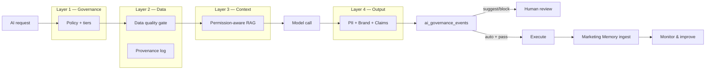

# InfoGenie — AI Governance Build Spec

**Version:** 1.0  
**Date:** 2026-08-03  
**Branch target:** `cursor/ai-governance-767a` (net-new, builds on `ecosystem-spine`)  
**Framework:** 4 Layers of AI Governance (Policy → Data → Retrieval → Output)

---

## 1. Problem statement

InfoGenie has **strong point solutions** (Safe Agent, Brand Safety, Marketing Memory, Data Provenance, Privacy Compliance, RBAC) but they are **not wired as a mandatory platform layer**. AI can still:

- Generate without retrieving trusted internal facts
- Apply side effects (calendar, email, ads) without output/compliance gates
- Return memory nodes regardless of user role
- Ship insights without provenance or freshness metadata

**Goal:** Every AI path follows:

```
Policy check → Data quality gate → Context retrieval → Model call → Output validation → Audit log → (optional) human approval → Execute
```

---

## 2. Design principles

| Principle | Implementation |
|-----------|----------------|
| **Extend, don't duplicate** | Wrap existing services; one governance orchestrator |
| **Fail closed in prod** | `AI_GOVERNANCE_MODE=enforce` blocks; `shadow` logs only |
| **Tenant + role scoped** | Governance respects `permission_matrix.js` |
| **Opt-in execution tiers** | `auto` / `suggest` / `block` per action type |
| **Universal audit** | Every governed call writes `ai_governance_events` |

---

## 3. Architecture overview

### New package: `services/ai_governance/`

```
services/ai_governance/
  schema.js          # policy, events, output_checks, data_quality_rules
  policy.js          # resolve tenant policy + risk appetite
  context_pack.js    # mandatory retrieval bundle before LLM
  output_gate.js     # brand safety + PII + content filters
  orchestrator.js    # govern({ tenant, user, surface, action, payload })
  hooks.js           # adapters for brief, spine, safe-agent, content, email
  api.js             # REST + status dashboard
```

### UI

```
components/features/manage/AiGovernanceHub.tsx   # Layer 1–4 dashboard
lib/viewRoutes.ts                                # Manage → AI Governance Hub
```

### Integration pattern

All high-risk surfaces call **one function** before LLM or side-effect:

```js
const { govern } = require('../ai_governance/orchestrator');

const result = await govern({
  tenantId: tid,
  userId: req.user?.id,
  surface: 'marketing_brief',      // enum
  action: 'generate',              // generate | apply | send | publish
  payload: { prompt, draft, meta },
  executionTier: 'suggest',        // from policy
});
// result: { allowed, contextPack, outputChecks, auditId, blockReason? }
```

---

## 4. Layer 1 — Governance (Policy, roles, accountability, risk appetite)

### 4.1 What exists today

| Asset | Location |
|-------|----------|
| RBAC matrix | `services/tenants/permission_matrix.js`, `permission_enforce.js` |
| Safe Agent approval | `services/safe_agent/` |
| Admin audit | `services/admin/audit.js` |
| Launch compliance | `services/launch_compliance/` |
| Budget guardrails | Safe Agent `budget_guardrail`, Optimizer caps |

### 4.2 Build

#### Schema: `ai_governance_policies`

```sql
CREATE TABLE ai_governance_policies (
  id              TEXT PRIMARY KEY,
  tenant_id       INTEGER NOT NULL REFERENCES tenants(id),
  -- Risk appetite
  default_mode    TEXT NOT NULL DEFAULT 'shadow',  -- shadow | enforce
  risk_appetite   TEXT NOT NULL DEFAULT 'balanced', -- conservative | balanced | aggressive
  -- Per action-type tiers (auto | suggest | block)
  action_tiers    JSONB NOT NULL DEFAULT '{}',
  -- Formal policy doc (markdown) + version
  policy_document TEXT,
  policy_version  INTEGER NOT NULL DEFAULT 1,
  ethics_contact  TEXT,          -- email / role owner
  updated_by      INTEGER REFERENCES users(id),
  updated_at      TIMESTAMPTZ NOT NULL DEFAULT now()
);
```

**Default `action_tiers`:**

```json
{
  "generate_content": "auto",
  "generate_brief": "auto",
  "apply_calendar": "suggest",
  "send_email": "suggest",
  "launch_campaign": "block",
  "scale_budget": "block",
  "publish_social": "suggest",
  "crm_push": "suggest"
}
```

#### API

| Method | Route | Purpose |
|--------|-------|---------|
| GET | `/api/ai-governance/policy` | Current tenant policy |
| PUT | `/api/ai-governance/policy` | Update policy + tiers |
| GET | `/api/ai-governance/status` | Layer health scorecard |
| GET | `/api/ai-governance/audit` | Paginated governance events |
| POST | `/api/ai-governance/review/:eventId` | Human approve/reject blocked action |

#### UI: AI Governance Hub — **Policy tab**

- Policy document editor (versioned)
- Risk appetite selector (conservative / balanced / aggressive)
- Action tier matrix (grid: action type × auto/suggest/block)
- Ethics / accountability owner field
- Enforcement mode toggle (shadow vs enforce) — admin only

#### Wire into existing modules

| Module | Change |
|--------|--------|
| `services/marketing_spine/actions.js` | `applyAction()` → call `govern()` first; respect `action_tiers.apply_calendar` |
| `services/safe_agent/api.js` | Merge Safe Agent proposals into governance audit stream |
| `services/decision_engine/api.js` | `/act/:id` requires tier check |
| `server.js` | Mount `/api/ai-governance` |

**Done when:** Tenant admin can set risk appetite; calendar apply respects tier; all governed events appear in one audit log.

---

## 5. Layer 2 — Data Strategy (lineage, access, quality)

### 5.1 What exists today

| Asset | Location |
|-------|----------|
| Data provenance | `services/data_provenance/` |
| Credential vault | `services/credentials/vault.js` |
| Tenant context | `services/tenants/context.js` |
| Marketing spine context | `services/marketing_spine/context.js` |
| Lead / audience tables | `lead_intel_leads`, `audience_segments` |

### 5.2 Build

#### Schema: `data_quality_rules` + extend provenance

```sql
CREATE TABLE data_quality_rules (
  id              TEXT PRIMARY KEY,
  tenant_id       INTEGER NOT NULL REFERENCES tenants(id),
  source_key      TEXT NOT NULL,        -- e.g. google_ads, hubspot, brief
  max_stale_hours INTEGER NOT NULL DEFAULT 168,
  min_coverage    NUMERIC(4,2) DEFAULT 0.8,
  required_fields JSONB DEFAULT '[]',
  enabled         BOOLEAN DEFAULT true
);

CREATE TABLE data_quality_scores (
  id              TEXT PRIMARY KEY,
  tenant_id       INTEGER NOT NULL,
  source_key      TEXT NOT NULL,
  score           INTEGER NOT NULL,     -- 0-100
  issues          JSONB NOT NULL DEFAULT '[]',
  checked_at      TIMESTAMPTZ NOT NULL DEFAULT now()
);
```

#### Service: `services/ai_governance/data_quality.js`

- `scoreSource(tenantId, sourceKey)` — freshness, null rate, connector health
- `gateBeforeAi(tenantId, requiredSources[])` — returns `{ ok, blockers[] }`

**Required sources by surface:**

| Surface | Required sources |
|---------|------------------|
| Marketing Brief | `brand_foundation`, `optimizer` OR `google_ads_insights`, `decision_engine` |
| Content AI | `brand_foundation`, `seo_tasks` OR `keyword_explorer` |
| Optimizer run | `ad_campaigns`, `pixel_configs` |
| Ecosystem Spine suggest | `audience_segments`, `attribution_runs` (soft warn if missing) |

#### Mandatory provenance logging

Create `services/ai_governance/provenance_bridge.js`:

- Wrap `data_provenance/api.js` `POST /log`
- Auto-call from `orchestrator.js` on every governed generation with:
  - `source_type`, `is_ai_estimated`, `ai_model`, `freshness_hours`, `data_snapshot`

#### UI: **Data tab**

- Source health cards (Google Ads, HubSpot, pixels, audiences, memory)
- Staleness alerts (“Brief used 14-day-old SERP data”)
- Lineage drill-down per insight key (reuse Data Provenance panel)

**Done when:** Brief generation refuses (enforce mode) or warns (shadow) when brand foundation missing; every governed output has provenance row.

---

## 6. Layer 3 — Retrieval & Context (permission-aware RAG)

### 6.1 What exists today

| Asset | Location |
|-------|----------|
| Marketing Memory | `services/knowledge_graph/` — embeddings, `queryMemoryNodes` |
| Memory ingest hooks | Decision Engine, crisis radar, ask_copilot, social_publisher |
| Ask copilot RAG | `services/ask_copilot/api.js` |

### 6.2 Gaps to close

- Retrieval is **tenant-wide**, not **role-scoped**
- Most generators **skip** memory retrieval
- No unified `context_pack` passed to all LLM calls

### 6.3 Build

#### Service: `services/ai_governance/context_pack.js`

```js
async function buildContextPack({ tenantId, userId, question, surface, permissions }) {
  // 1. Permission-filtered memory retrieval
  // 2. Brand foundation snippet
  // 3. Recent provenance-backed facts (top 5)
  // 4. Competitor snapshot if analyse surface
  // 5. Policy constraints (disallowed claims, jurisdictions)
  return {
    memory_nodes: [...],
    brand: {...},
    facts: [...],
    citations: [...],
    retrieval_meta: { filtered_by_role: true, node_count: N }
  };
}
```

#### Permission-aware memory filter

Extend `services/knowledge_graph/api.js`:

```js
// New: filter nodes by node_type × user permission keys
const NODE_TYPE_PERMS = {
  campaign_result: 'grow.campaigns.view',
  lead_event: 'grow.optimizer.view',
  competitor_signal: 'compete.intel.view',
  manual_observation: 'creator.view',
  // ...
};

async function queryMemoryNodes(tenant_id, question, queryVec, { userId, limit }) {
  const allowedTypes = await filterTypesByUserPermissions(userId, tenant_id);
  // ... existing cosine search, then .filter(n => allowedTypes.has(n.node_type))
}
```

#### Mandatory retrieval surfaces (Phase 1)

| Surface | File to patch |
|---------|---------------|
| Marketing Brief | `services/marketing_brief/generator.js` |
| Decision Engine | `services/decision_engine/api.js` `runAnalyse` |
| Content AI | `services/content/` or equivalent generator |
| Ask InfoGenie | `services/ask_copilot/api.js` (already partial) |
| Ecosystem Spine suggest | `services/marketing_spine/actions.js` |

**Prompt injection template** (shared):

```
SYSTEM: Answer using ONLY the provided context_pack. Cite sources as [memory:ID] or [provenance:KEY].
If context is insufficient, say "insufficient grounded data" — do not invent metrics.
CONTEXT_PACK: {{JSON}}
```

#### UI: **Context tab**

- Retrieval coverage % (how many AI calls used context pack last 7d)
- Memory nodes by type + permission class
- “Ungrounded outputs” list (generations that skipped retrieval)

**Done when:** Brief + Decision Engine always attach context pack; memory query filters by role; ungrounded calls visible in dashboard.

---

## 7. Layer 4 — Model & Output Controls

### 7.1 What exists today

| Asset | Location |
|-------|----------|
| Brand Safety | `services/brand_safety/` — FTC, GDPR, FCA, etc. |
| Privacy / PII | `services/privacy_compliance/` |
| AI Audit Suite | `components/features/grow/AiAuditSuite.tsx` — hallucination tracking |
| Pixel hashing | `services/pixel_manager/` |

### 7.2 Build

#### Service: `services/ai_governance/output_gate.js`

Pipeline (sequential, fail-fast in enforce mode):

```
1. PII scan        → privacy_compliance patterns
2. Brand safety    → brand_safety/check (jurisdictions from policy)
3. Claim scan      → require citation if numbers/ROAS/% in output
4. Content filter  → blocklist + policy_document rules
5. Risk score      → aggregate → pass | caution | block
```

#### Schema: `ai_governance_output_checks`

```sql
CREATE TABLE ai_governance_output_checks (
  id              TEXT PRIMARY KEY,
  tenant_id       INTEGER NOT NULL,
  governance_event_id TEXT REFERENCES ai_governance_events(id),
  check_type      TEXT NOT NULL,   -- pii | brand_safety | claim_citation | content_filter
  verdict         TEXT NOT NULL,   -- pass | caution | block
  risk_score      INTEGER,
  detail          JSONB,
  created_at      TIMESTAMPTZ NOT NULL DEFAULT now()
);
```

#### Schema: `ai_governance_events` (master audit)

```sql
CREATE TABLE ai_governance_events (
  id              TEXT PRIMARY KEY,
  tenant_id       INTEGER NOT NULL,
  user_id         INTEGER REFERENCES users(id),
  surface         TEXT NOT NULL,
  action          TEXT NOT NULL,
  execution_tier  TEXT,
  status          TEXT NOT NULL,   -- allowed | blocked | pending_review | applied
  context_pack_id TEXT,
  input_hash      TEXT,
  output_preview  TEXT,
  block_reason    TEXT,
  created_at      TIMESTAMPTZ NOT NULL DEFAULT now(),
  resolved_at     TIMESTAMPTZ,
  resolved_by     INTEGER REFERENCES users(id)
);
```

#### Outbound gates (mandatory before side effect)

| Action | Gate before |
|--------|-------------|
| Email send | `email-broadcast` send route |
| Social publish | `social-publisher` post route |
| Calendar apply | `marketing_spine/actions.js` `applyAction` |
| Safe Agent execute | `safe_agent/api.js` approve |
| CRM push | `crm-sync/push` |

#### Monitoring & alerts

- Cron: `services/ai_governance/monitor.js` — scan last 24h for `verdict=block` rate spike
- Hook: optional `SENTRY_DSN` for `governance_block` events (when env set)
- Dashboard widget: “Outputs caught pre-production” counter

#### UI: **Output tab**

- 24h pass / caution / block chart
- Recent blocked outputs with rewrite suggestions (from Brand Safety)
- PII flags
- Link to AI Audit Suite hallucination runs

**Done when:** Email send and calendar apply cannot proceed on `block` verdict in enforce mode; all checks logged.

---

## 8. Unified flow (target state)



---

## 9. Phased delivery

### Phase A — Foundation (ship first)

**Scope:** Schema + orchestrator + hub shell + spine/safe-agent hooks

| Task | Files |
|------|-------|
| Create `services/ai_governance/*` | schema, policy, orchestrator, api |
| Mount API | `server.js` |
| AI Governance Hub UI | `components/features/manage/AiGovernanceHub.tsx` |
| Wire calendar apply gate | `marketing_spine/actions.js` |
| Wire Safe Agent audit merge | `safe_agent/api.js` |
| Permissions | `permission_matrix.js` |
| Tests | `test/ai-governance.test.js` |

**Exit criteria:** Policy CRUD works; calendar apply blocked in enforce when brand safety fails; audit log visible.

### Phase B — Data + provenance

| Task | Files |
|------|-------|
| Data quality scorer | `ai_governance/data_quality.js` |
| Provenance bridge | auto-log on all governed calls |
| Brief data gate | `marketing_brief/generator.js` |
| Hub Data tab | UI |

**Exit criteria:** Brief warns on stale/missing sources; provenance row per governed generation.

### Phase C — Permission-aware RAG

| Task | Files |
|------|-------|
| `context_pack.js` | unified bundle |
| Memory role filter | `knowledge_graph/api.js` |
| Patch Brief, Decision Engine, Ask | respective generators |
| Hub Context tab | UI |

**Exit criteria:** ≥80% of Brief/Decision calls show context pack in audit; role cannot retrieve restricted memory types.

### Phase D — Universal output gate

| Task | Files |
|------|-------|
| `output_gate.js` | full pipeline |
| Email + social gates | `email_broadcast`, `social_publisher` |
| Monitor cron | `ai_governance/monitor.js` |
| Hub Output tab | UI |

**Exit criteria:** No email send with critical brand-safety flag in enforce mode; block rate visible on dashboard.

### Phase E — Enterprise polish

- Policy templates by vertical (finance, health, agency)
- Export audit log (CSV/PDF) for compliance reviews
- Webhook on `governance_block` for Slack/email
- SOC2-style retention policy on `ai_governance_events`

---

## 10. Configuration

```env
# Governance
AI_GOVERNANCE_MODE=shadow          # shadow | enforce (prod default: enforce)
AI_GOVERNANCE_BLOCK_ON_CAUTION=0   # 1 = treat caution as block
AI_GOVERNANCE_REQUIRE_CONTEXT=1    # 1 = block ungrounded generations in enforce
AI_GOVERNANCE_DEFAULT_JURISDICTIONS=ftc,gdpr

# Existing (required for full Layer 4)
SENTRY_DSN=                        # optional alerting
```

---

## 11. Nav & permissions

| View | Path | Permission |
|------|------|------------|
| AI Governance Hub | `/manage/ai-governance` | `tenant.integrations.manage` (write), `grow.campaigns.view` (read) |

Add to `lib/viewRoutes.ts` → Manage → “3 · AI tools & config” (near Safe Agent).

---

## 12. Success metrics

| Metric | Target (90 days post Phase D) |
|--------|-------------------------------|
| Governed AI calls with context pack | ≥85% |
| Outputs blocked pre-production | measurable baseline + trend down for false positives |
| Insights with provenance | ≥90% of Brief/Decision outputs |
| Permission-filtered memory queries | 100% |
| Enterprise audit export usage | ≥1 export/month per agency tenant |

---

## 13. Explicit non-goals

- Building an ethics committee workflow product (use policy owner + review queue instead)
- Replacing HubSpot/Salesforce DLP
- Training custom models
- Full SOC2 certification (spec supports audit trail only)

---

## 14. Relationship to Ecosystem Spine

| Ecosystem Spine | AI Governance |
|-----------------|---------------|
| **What** to do (actions) | **Whether** AI may do it safely |
| `marketing_actions` | `ai_governance_events` |
| `suggest → apply` | `govern → review → execute` |

**Integration:** `marketing_spine/actions.js` `applyAction()` calls `govern()` before any mutation. Ecosystem Spine becomes the **execution layer**; AI Governance becomes the **control plane**.

---

## 15. Immediate next PR (recommended)

**Branch:** `cursor/ai-governance-767a`  
**PR title:** AI Governance Hub — Phase A foundation

1. `services/ai_governance/{schema,policy,orchestrator,output_gate,api}.js`
2. `components/features/manage/AiGovernanceHub.tsx`
3. Gate on `marketing_spine/actions.js` + `safe_agent/api.js`
4. `test/ai-governance.test.js`
5. Add **Governance** tab link next to Ecosystem in `CompanyContextBar.tsx` (optional)

Estimated surface area: ~12 files, ~1,200 LOC — extends existing modules, no rewrites.
