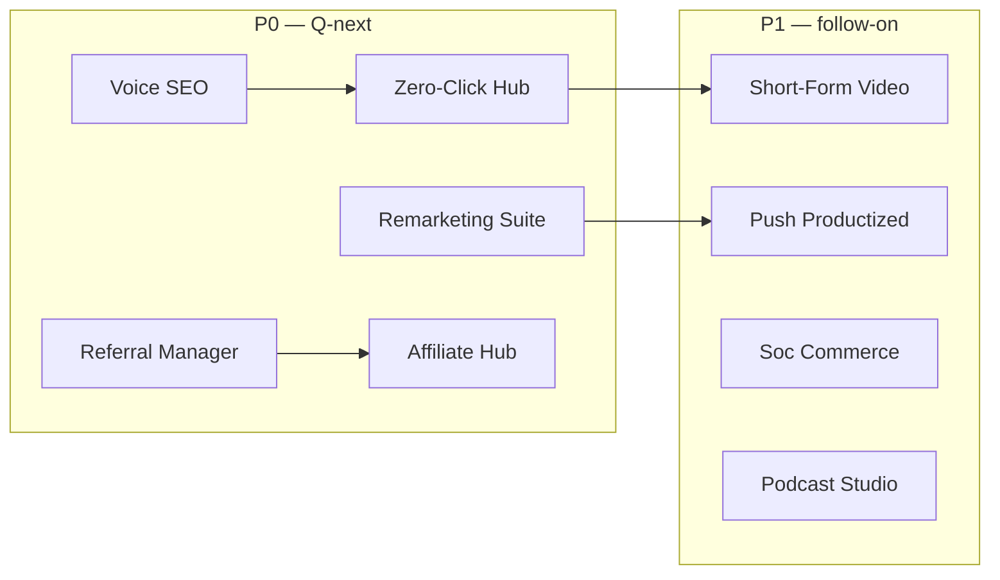

# InfoGenie Gap-Priority Roadmap
## vs. “50 Types of Digital Marketing” (2026)

**Purpose:** Close the biggest product gaps from the 50-type taxonomy without duplicating what InfoGenie already does well.

**How to read this doc**
- **P0** — Build next; highest leverage on existing stack
- **P1** — Important; ship after P0 or in parallel if resourced
- **P2** — Valuable but niche, partner-first, or UI-packaging of existing capability
- **Relabel** — Already partially covered; improve nav, positioning, or depth before net-new build

**Coverage today (honest)**
- ~28/50 **strong** dedicated coverage
- ~16/50 **partial** (related tools exist, not a standalone product)
- ~6/50 **weak/missing**

---

## Strategic north star

InfoGenie should not become 50 separate point products. The moat is:

1. **AI search + performance marketing** (SEO → GEO/AEO → paid → leads → ROI)
2. **Unified data spine** (pixels, audiences, attribution, reporting)
3. **Agentic execution** (Optimizer, Lead Intelligence, AutoClaw, Safe Agent)

Prioritize gaps that **strengthen the loop**: *discover → create → reach → measure → optimize*.

---

## P0 — Build next (highest leverage)

### 1. Zero-Click & AI SERP Hub
| | |
|---|---|
| **Gap** | #10 Zero-Click Search Marketing |
| **Why now** | Direct extension of AEO + GEO; 2026 buyers expect AI Overview / PAA / featured-snippet tracking |
| **Already have** | AEO Optimizer, GEO Audit, SERP Tracker, Search Pulse, Schema Generator |
| **Build** | Single hub: track featured snippets, PAA wins/losses, AI Overview citations, “clickless impression” estimates; tie fixes back to AEO tasks |
| **Leverage** | `services/aeo/`, `services/geo`, `services/serp_tracker/`, DataForSEO SERP |
| **Done when** | User sees zero-click footprint + prioritized fix list per URL/keyword |

### 2. Retargeting & Remarketing Suite
| | |
|---|---|
| **Gap** | #47 Remarketing / Retargeting |
| **Why now** | Paid social/search already exist; audiences + pixels are fragmented |
| **Already have** | Pixel Manager, Dynamic Audiences, Audience → Ad Sync, Conversion Recovery (CAPI) |
| **Build** | “Remarketing Center”: audience health, pixel/CAPI status, suggested retargeting segments, cross-platform sync checklist, budget split recommendations |
| **Leverage** | `pixel_manager`, `audiences`, Meta/Google/TikTok insights |
| **Done when** | One screen answers “are we retargeting properly?” with actionable fixes |

### 3. Referral Program Manager
| | |
|---|---|
| **Gap** | #35 Referral Marketing |
| **Why now** | High ROI channel; complements Lead Intelligence + Customer 360 |
| **Already have** | Playbook mentions, Digital Twin scenarios, Re-Engage drips, Link-in-Bio + Stripe |
| **Build** | Referral links, reward rules, fraud checks, referrer dashboard, webhook to CRM; optional Stripe coupon integration |
| **Leverage** | `conversion_boosters`, `lead_intelligence`, `linksell`, `hubspot-sync` |
| **Done when** | Launch a referral program without leaving InfoGenie |

### 4. Affiliate Program Hub
| | |
|---|---|
| **Gap** | #34 Affiliate Marketing |
| **Why now** | Brand Deals + affiliate content mode exist but no program ops layer |
| **Already have** | Brand Deals (`affiliate` deal type), affiliate-friendly Content Modes, playbooks |
| **Build** | Affiliate onboarding, tracking links, commission tiers, payout report, creative kit, compliance guardrails |
| **Leverage** | `brand_deals`, `utm_builder`, `content_modes`, white-label reports |
| **Done when** | Agency can run affiliate + influencer deals in one pipeline |

### 5. Voice Search Optimization
| | |
|---|---|
| **Gap** | #6 Voice Search Optimization |
| **Why now** | Natural extension of Technical SEO + AEO; low incremental API cost |
| **Already have** | FAQ/schema checks in AEO, Website Audit, Content Score |
| **Build** | Voice-readiness score: conversational queries, speakable schema, answer length, local “near me” signals, featured-snippet overlap |
| **Leverage** | `aeo/analyzer`, `seo_auditor`, `schema_generator` |
| **Done when** | Audit report includes voice-specific fixes alongside AEO |

---

## P1 — Next wave (important, moderate build)

### 6. Short-Form Video Workflow
| | |
|---|---|
| **Gap** | #15 Short-Form Video Marketing |
| **Already have** | TikTok Ads, Social Publisher, Video Script, UGC Avatars, TikTok Downloader |
| **Build** | Reels/Shorts/TikTok campaign template: hook → script → caption → hashtags → publish → post-performance loop |
| **Done when** | End-to-end short-form campaign from one wizard |

### 7. Push Notification Marketing (productize)
| | |
|---|---|
| **Gap** | #41 Push Notification Marketing |
| **Already have** | Omnichannel Composer label mentions Push; RCS campaigns |
| **Build** | Web push + mobile push connectors (OneSignal/Firebase), segment triggers, send analytics |
| **Done when** | Push is a first-class channel in omnichannel, not a label only |

### 8. Social Commerce Expansion
| | |
|---|---|
| **Gap** | #24 Social Commerce Marketing |
| **Already have** | Link-in-Bio + Stripe, Social Publisher, product library |
| **Build** | Shoppable posts, catalog sync, UTMs for product links, conversion tracking per SKU |
| **Done when** | Creator can sell from social with attributable revenue |

### 9. Podcast Marketing Studio
| | |
|---|---|
| **Gap** | #16 Podcast Marketing |
| **Already have** | Podcast Monitor (competitive intel) |
| **Build** | Episode brief → show notes → audiogram clips → guest outreach → distribution checklist |
| **Done when** | Podcast is creation + distribution, not just monitoring |

### 10. Newsletter Marketing (unify)
| | |
|---|---|
| **Gap** | #17 Newsletter Marketing |
| **Already have** | Email Broadcast, Email Designer, Newsletter Tracker (competitor intel) |
| **Build** | “Newsletter Studio”: list growth, issue builder, A/B subject lines, archive, subscribe analytics |
| **Done when** | Own newsletter ops match competitor tracking in one module |

### 11. Interactive Content Builder
| | |
|---|---|
| **Gap** | #18 Interactive Content Marketing |
| **Already have** | Surveys, Conversion Boosters (popups), A/B Designer |
| **Build** | Quizzes, calculators, assessments with lead capture + scoring → Lead Intelligence |
| **Done when** | Interactive assets feed qualified leads automatically |

### 12. Thought Leadership Hub
| | |
|---|---|
| **Gap** | #20 Thought Leadership Marketing |
| **Already have** | Press Release, LinkedIn Outreach, Content AI, PR workflows |
| **Build** | Executive content calendar, byline tracker, speaking/opportunity pipeline, authority score |
| **Done when** | B2B teams can run a TH program with measurable pipeline impact |

### 13. Influencer tier workflows (nano / micro)
| | |
|---|---|
| **Gap** | #32–33 Nano / Micro-Influencer Marketing |
| **Already have** | Influencer Discovery + CRM |
| **Build** | Tier filters, rate benchmarks, bulk outreach templates, UGC rights tracking |
| **Done when** | Same CRM supports nano → macro with tier-specific playbooks |

### 14. Community Marketing (lightweight)
| | |
|---|---|
| **Gap** | #25 Community Marketing |
| **Already have** | Unified Inbox, Employee Advocacy, Social Listening |
| **Build** | Community health dashboard: engagement rate, advocate leaderboard, moderation queue |
| **Done when** | Community ops visible without building a full forum product |

### 15. Display Advertising Module
| | |
|---|---|
| **Gap** | #44 Display Advertising |
| **Already have** | CTV & Streaming Audio, Google/Meta display placements via Advertise Hub |
| **Build** | Display campaign wizard, creative sizes, placement report, view-through attribution |
| **Done when** | Display is as visible as search/social in Advertise Hub |

---

## P2 — Later / partner-first / niche

| # | Gap | Recommendation |
|---|---|---|
| 9 | **ASO** (App Store Optimization) | Partner with AppTweak/AppFollow or build keyword + metadata audit only if mobile vertical demands it |
| 26 | **Live Streaming Marketing** | Integrate YouTube Live / Twitch / Instagram Live analytics; defer full production suite |
| 28 | **Meme Marketing** | Ship as **Creative Intel template pack** + trend alerts, not standalone product |
| 45 | **Native Advertising** | Partner (Taboola/Outbrain) or tab inside Display module |
| 46 | **Programmatic Advertising** | Partner (DV360/The Trade Desk) — do not build bidder; expose reporting + audience export |
| 36 | **Partnership Marketing** | Extend Brand Deals + stakeholder CRM; low urgency if P0 affiliate/referral ships |

---

## Relabel first (quick wins — no net-new product)

**Status: shipped** — hub landing pages + nav regrouping.

| Infographic type | Hub / nav entry | URL |
|---|---|---|
| SEM / PPC (#7–8) | **Paid Search & Social — start here** (Grow) | `/grow/paid-search-social` |
| Content / AI content (#11–12) | **Content Studio** (Create §2) | `/create/content-studio` |
| Organic / paid social (#21–23) | **Social Command Center** (Reach §4) | `/reach/social-command-center` |
| Email + automation (#37–38) | **Lifecycle Email** (Create §3) | `/create/lifecycle-email` |
| SMS / WhatsApp (#39–40) | **Messaging Channels** + dashboard strip | `/reach/messaging-channels` |
| Conversational (#42) | **Conversational AI** (Create §5) | `/create/conversational-ai` |
| CRO (#49) | **Conversion Lab** (Grow §4) | `/grow/conversion-lab` |
| Growth (#50) | **Growth Marketing — start here** (Grow §1) | `/grow/growth-hub` |

URL aliases (`ppc`, `sem`, `cro`, `email-marketing`, `social-media`, etc.) resolve to these hubs.

---

## Suggested execution sequence

**Recommended build order (single team):**
1. Zero-Click & AI SERP Hub
2. Retargeting & Remarketing Suite
3. Voice Search Optimization (fast follow to AEO)
4. Referral Program Manager
5. Affiliate Program Hub
6. Short-Form Video Workflow
7. Push + Social Commerce (parallel if 2 engineers)

---

## Success metrics (per priority tier)

| Tier | KPI |
|---|---|
| **P0** | +3 infographic categories move from Partial → Strong; attach rate to existing SEO/paid users |
| **P1** | +15% module depth score in user activation (users using 2+ channels in same campaign) |
| **P2** | Partner revenue or ≤2 sprints build; only if vertical playbook demand |
| **Relabel** | −30% “where is X?” support questions; improved nav discoverability |

---

## What we should NOT build

- A full **programmatic DSP** (buy via partners)
- A **community forum platform** (integrate Discord/Slack/Circle)
- A **meme generator** as standalone SKU (template pack only)
- Duplicate **CRM** (keep HubSpot/Salesforce sync positioning)

---

## Mapping: 50 types → status after roadmap

If P0 + P1 + Relabel complete:

| Status | Before | After (target) |
|---|---|---|
| Strong | ~28 | ~40 |
| Partial | ~16 | ~8 |
| Missing | ~6 | ~2 (ASO, programmatic buying remain partner-led) |

---

*Last updated: 2026-08-03 · Branch: `cursor/full-app-hardening-767a`*
